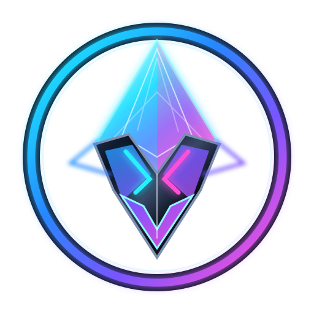
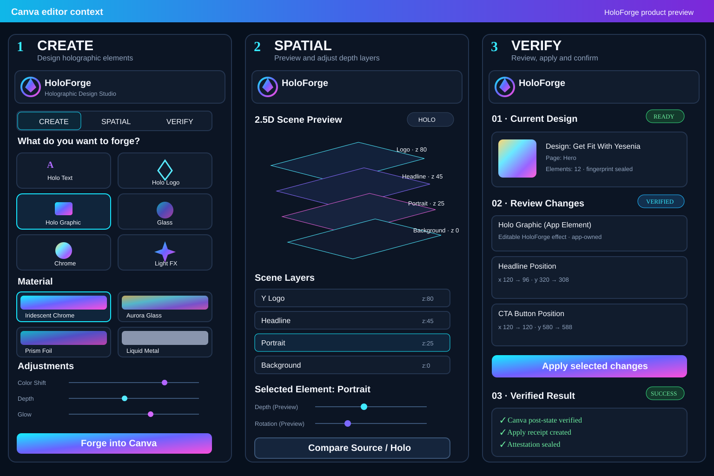

# HOLOFORGE Holographic Design Studio for Canva

HOLOFORGE is a Canva holographic design studio for creating holographic visual treatments, previewing designs spatially, and explicitly applying verified supported changes inside Canva's narrow sidebar interface.

<p align="center">
  
</p>



> **Product interface preview:** the image above documents the approved slim-sidebar visual direction. It is intentionally labeled as a preview rather than a runtime screenshot; the capability matrix below remains the source of truth for what HoloForge can execute today.

## Standalone application boundary

HoloForge is a dedicated Canva Design Editor app under `apps/holoforge-canva/`. It owns its own manifest, package metadata, source entrypoint, tests, build, and distribution ZIP. DepthPop is a separate Canva app and is not bundled into HoloForge.

## User workflow

```text
CREATE
  ↓
PREVIEW
  ↓
SPATIAL
  ↓
VERIFY
  ↓
APPLY
  ↓
PROOF
```

The studio keeps creation, spatial presentation, and verified mutation separate so unsupported visual ideas never masquerade as Canva-native writes.

## Sidebar information architecture

The interface is deliberately compact and optimized for Canva's slim app panel:

1. **CREATE** — choose a creation type, select one of nine deterministic material presets, tune the material, preview it, and forge supported effects into Canva.
2. **SPATIAL** — inspect a 2.5D source/candidate view and layer depth without pretending depth is a native Canva property.
3. **VERIFY** — capture the exact design state, review trusted scenario changes, explicitly Apply, verify the post-state, and seal a receipt/attestation.

## Creation types

The initial studio exposes:

- Holo Text
- Holo Logo
- Holo Graphic
- Glass
- Chrome
- Light FX

`Holo Graphic`, `Glass`, `Chrome`, and `Light FX` currently have a real Canva execution route through editable HoloForge **app elements**. Holo Text and Holo Logo remain preview-only until a trusted source-text/source-logo binding is implemented; Forge stays disabled rather than inventing a target.

## Material presets

The deterministic preset registry contains:

- Iridescent Chrome
- Aurora Glass
- Prism Foil
- Liquid Metal
- Spectral Pearl
- Neon Haze
- Crystal Frost
- Holo Gold
- Holo Gunmetal

Material data includes color shift, preview depth, reflection, glow, grain, angle, transparency, and motion intent.

## Capability matrix

| Property / effect | Route | Current behavior |
| --- | --- | --- |
| `x`, `y`, `rotation` | Canva native | Written only through the existing verified scenario Apply path |
| color shift | HoloForge app element | Forged into Canva as editable app-owned effect metadata |
| reflection | HoloForge app element | Rendered into the deterministic app element |
| glow | HoloForge app element | Rendered into the deterministic app element |
| grain | HoloForge app element | Rendered into the deterministic app element |
| material angle | HoloForge app element | Controls deterministic spectral material direction |
| transparency | HoloForge app element | Controls forged material opacity |
| depth / z | Preview only | Used by the 2.5D spatial model; never written as fake Canva depth |
| shimmer / sweep / pulse | Preview only | Motion intent is retained for presentation; forged elements are static today |
| generated raster asset | Unavailable | No authenticated generation provider is configured; HoloForge fails closed |

## Real Canva creation path

Rich holographic materials use Canva **app elements**. HoloForge persists compact material metadata and deterministically renders an SVG texture into an app-owned image element. This creates a real Canva design element that remains owned/editable by HoloForge without claiming unsupported native shader APIs.

The app-element path is intentionally distinct from the existing scenario Apply path:

- **Create / Forge** adds a HoloForge-owned material element.
- **Verify / Apply** mutates reviewed existing elements using the established trusted scenario boundary.

Canva app-element creation requires the app's Developer Portal configuration to grant the Design Content read/write permissions expected by the Design Editing API. The repository does not hard-code or bypass those platform permissions.

## Spatial presentation

The existing `spatial-preview.ts` and `spatial-scenario-view.ts` models remain renderer-neutral. Depth is presentation data, not a hardware command and not a fabricated Canva property. The Source/Holo comparison exists to explain proposed spatial relationships before any supported write occurs.

## Verified execution guarantees

The VERIFY path preserves the repository's stronger production safety controls:

- `useFeatureSupport(openDesign)` capability detection
- trusted design and page identity checks
- immutable scenario snapshots for presentation
- canonical provenance verification
- stale snapshot protection
- exact reviewed element binding
- single-flight Apply gating
- reviewed-context change detection during Apply
- post-apply fingerprint verification
- immutable verification receipt
- reviewed Apply attestation
- explicit user Apply only
- no auto-apply

## Generated assets

A separate generated-asset capability exists conceptually for effects that cannot be represented with app-owned deterministic elements. No authenticated generation provider is configured in this repository today, so that path is deliberately unavailable. HoloForge reports the limitation instead of pretending a generated asset was created.

## Non-goals

- No hidden automatic edits.
- No fake Canva shader or depth API.
- No unauthenticated generation provider.
- No physical actuation.
- No mutation of authenticated historical replay bytes.
- No weakening of the existing verification boundary to make the studio look more capable than it is.
